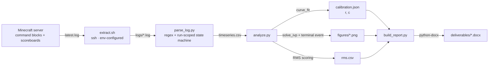
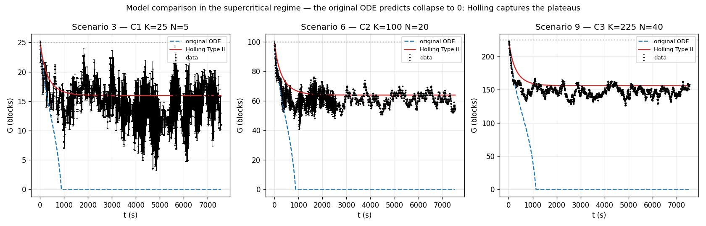

# AMODEL — A Minecraft Ordinary Differential Equation Lab

[](https://www.python.org/)
[](https://scipy.org/)
[](https://numpy.org/)
[](https://pandas.pydata.org/)
[](https://matplotlib.org/)
[](LICENSE)
[](https://github.com/13rianVargas/A-Minecraft-Ordinary-Differential-Equation-Lab/actions/workflows/ci.yml)

A reproducible measurement pipeline that turns raw Minecraft server logs into
calibrated ODE parameters, and the experimental result that came out of it.

*A Minecraft Ordinary Differential Equation Lab* — **AMODEL**, which is also
what it produces, and what the experiment ends up correcting.

---

## Executive summary

A Minecraft server is instrumented as a controlled ecology lab. Six fenced
corrals of varying carrying capacity `K` hold a fixed number of sheep `N` that
graze a grass stock `G`. Command-block chains reset each corral, control the
run, count the remaining grass, and emit the counts into the server log. That
log is the raw measurement record.

This repository is the pipeline that turns that record into science:

**ingest → parse → calibrate → integrate → score → report**

Each stage communicates only through files on disk, so any stage can be rerun
in isolation and every intermediate artifact is inspectable. From 27 648
samples across 12 experimental scenarios plus 10 calibration runs, it fits the
two free parameters of the logistic-harvesting model

```
dG/dt = r·G·(1 − G/K) − c·N
```

yielding `r = 0.005037 1/s` and `c = 0.010355 blocks/(sheep·s)`, and from those
the saddle-node bifurcation threshold `N_crit = rK/(4c) = 0.1216·K` that
separates a persistent pasture from a collapsing one.

The pipeline then earned its keep by falsifying the model it was built to fit.
Above `N_crit` the classical model predicts total collapse to zero. The
experiment never collapsed — in all three supercritical scenarios the grass
settled at a stable non-zero plateau. Replacing the constant grazing drain with
a saturating Holling Type II functional response reproduces those plateaus and
cuts the error by 81–91 % exactly where the original model failed, while
performing *worse* where the original was already correct. The two models are
complementary, and locating that boundary is the actual finding.

Full derivations, protocol and results: **[docs/FINDINGS.md](docs/FINDINGS.md)**.

---

## How the lab works

You do not need to know Minecraft to follow this. The game happens to implement
a small, fully deterministic ecology, and the whole project rests on that.

### The three quantities

| In the game | In the model | What it is |
|---|---|---|
| Grass blocks inside a fenced corral | `G` | The resource. Grows on its own, gets eaten. |
| Sheep inside that corral | `N` | The consumers. Fixed for the duration of a run. |
| Area of the corral | `K` | Carrying capacity — the most grass that can ever fit. A 10×10 corral has `K = 100`. |

A corral is a fenced square filled with grass. Drop in `N` sheep, start the
clock, and count the grass every few seconds. That count over time is the raw
data, and everything else is arithmetic.

### How grass grows back

Minecraft does not update every block every tick — that would be far too much
work. Instead it uses **random ticks**. The world is divided into 16×16×16
cubes of 4096 blocks, and on every game tick the game picks a few blocks at
random from each cube and updates only those. How many it picks is the
`randomTickSpeed` game rule, which defaults to **3**.

So each individual block waits its turn. With 3 picks out of 4096 blocks, any
given block gets a random tick on average **once every ~68 seconds** (median
~47 s — the wait is very uneven, which is where the noise in the data comes
from).

When a grass block does get its random tick, it tries to spread: it makes
**4 attempts**, each picking a random block in a **3×5×3** box around itself,
and any dirt block it lands on becomes grass. Two conditions matter: the source
grass needs light level **9 or brighter** above it, and light has to be able to
reach the target dirt.

That is the `r·G·(1 − G/K)` half of the model. More grass means more blocks
rolling for spread, so growth accelerates — but the corral is finite, so as it
fills up the attempts increasingly land on grass that is already there, and
growth stalls. That self-braking behaviour is exactly what a logistic term
describes.

### How sheep eat it

An adult sheep has a **1 in 500** chance, **every other game tick**, of
starting to graze. A lamb is far greedier at 1 in 25. When a sheep grazes, the
grass block it is standing on **turns to dirt** and the sheep regrows its wool.
This only works with the `mobGriefing` game rule on — otherwise sheep regrow
wool without consuming anything, and there is no experiment.

That is the `− c·N` half: each sheep removes grass at some rate `c`, and there
are `N` of them.

### The time base

Minecraft normally runs at **20 ticks per second**, so one tick is 50 ms. The
`/tick rate` command (added in 1.20.3) speeds that up; the runs here used
`/tick rate 5000`.

This is only an accelerator. Every measurement is timestamped in **game ticks**
divided by 20 — the `t_segundos` column is in-game seconds, never wall-clock
seconds. So a run that took three real minutes may cover three in-game hours,
and the physics is identical either way. The server never actually reached 5000
TPS under the command-block load, and it does not matter.

### Why measure any of this, if the constants are public?

Here is the part worth sitting with. Every number above is documented. So why
not just compute the answer?

Take the sheep. 1 in 500 every other tick, at 20 ticks per second, is 10 rolls
per second, giving **0.02 grass blocks per sheep per second** as the ceiling.

Measured: **0.0104**. About **52 %** of that ceiling.

The missing half is everything the constants do not tell you. A sheep can only
eat the block it is standing on, so it has to *walk* to grass first. It bumps
into other sheep, into fences, into water. It wanders. The published rate is
what a sheep does when grass is already underfoot; the measured rate is what a
sheep achieves in a real corral.

And that gap is not constant — it grows as grass gets scarce and the sheep
spend more of their time searching. Which is precisely why the constant-drain
term `− c·N` fails in the crowded scenarios, and why the saturating
Holling term `− c·N·G/(G+h)` fixes it. The correction this project ends up
making is, in the end, a statement about how long a sheep spends looking.

**Sources:** [Grass Block](https://minecraft.wiki/w/Grass_Block) ·
[Sheep](https://minecraft.wiki/w/Sheep) · [Tick](https://minecraft.wiki/w/Tick)

---

## System architecture



The contract between stages is a file format, not a function signature:

| Stage | Input | Output |
|---|---|---|
| `extract.sh` | live server log | `logs/<run>.log` |
| `parse_log.py` | `logs/` | `data/timeseries.csv` |
| `analyze.py` | `data/timeseries.csv` | `data/calibration.json`, `data/rms.csv`, `figures/*.png` |
| `build_report.py` | calibration + RMS + figures | `deliverables/*.docx` |

---

## Key features

**Run-scoped parsing of a cumulative log.** The server never rotates
`latest.log`, so it accumulates every run in the session. The parser rewinds to
the final `#running to 1` marker and reads only from there, so an extraction
captures the current replica no matter how much history precedes it
([`parse_log.py:124`](scripts/parse_log.py#L124)).

**Design-derived metadata over observed metadata.** The in-world command block
for corral 6 wrote `Corral to 5`, conflating two corrals. Rather than patch
around the symptom, the parser stops trusting that field entirely and derives
the corral from the scenario number, which is fixed by design. The instrument
has since been repaired, and the parser still ignores it — logs captured before
the fix carry the wrong value, and a quantity fixed by experimental design
should not depend on an instrument being configured correctly
([`parse_log.py:53`](scripts/parse_log.py#L53)).

**Two-stage parameter estimation.** `r` is fitted first from sheep-free runs
where the model reduces to the pure logistic and a closed form exists. `c` is
then fitted against the full ODE trajectory with `r` held fixed, leaving one
free parameter — far more robust at low `N` than the initial-slope estimator it
retains as a fallback ([`analyze.py:207`](scripts/analyze.py#L207)).

**Absorbing boundary as an integration event, not a clamp.** Enforcing `G ≥ 0`
by clamping the derivative makes the right-hand side discontinuous, and
`odeint`'s LSODA driver fails on it: on one scenario it aborted mid-integration
and returned a trajectory diverging to `G ≈ 7540` against a carrying capacity of
225, at a point that varied between runs on identical input. Expressing the
boundary as a terminal event in `solve_ivp` removes the discontinuity from the
solver's path and makes all 12 scenarios deterministic
([`analyze.py:107`](scripts/analyze.py#L107), rationale in
[FINDINGS §9.8](docs/FINDINGS.md#98-the-absorbing-boundary-broke-the-integrator)).

**Closed-form equilibria for both models,** including the quadratic root for
the Holling variant and the bifurcation threshold, so numerical results always
have an analytic check to sit against.

**Deterministic and reproducible.** `analyze.py` regenerates every published
number and figure from the committed CSV. Two runs on the same machine are
byte-identical; across platforms the calibration agrees to better than 1e-9,
which is far tighter than the six significant figures ever quoted. Exact
bit-for-bit equality across platforms is not achievable here — `curve_fit`
runs on platform-tuned BLAS — and CI asserts both properties separately.

---

## Tech stack

| Technology | Role in the architecture |
|---|---|
| **SciPy** | `solve_ivp` integrates both models with event detection; `curve_fit` performs the two-stage parameter estimation |
| **NumPy** | Vectorised trajectory and RMS arithmetic |
| **pandas** | Replica aggregation (mean ± σ per timestamp) and the CSV tables |
| **Matplotlib** | Headless figure generation via the `Agg` backend — no display required in CI |
| **python-docx** | Programmatic report assembly with embedded figures and generated tables |
| **Bash** | Ingestion CLI over SSH, with direct and `docker exec` access modes |
| **pytest** | Parser tests against synthetic fixtures, since real logs cannot be published |

---

## Results

Calibrated from 5 replicas each of `r` and `c`:

| Parameter | Value | Unit |
|---|---|---|
| `r` | 0.005037 | 1/s (in-game second) |
| `c` | 0.010355 | blocks/(sheep·s) |
| `N_crit` | `rK/(4c)` = 0.1216·K | sheep |

Model comparison across the 12 scenarios (RMS in grass blocks, lower is
better):

| Scenario | Regime | RMS original | RMS Holling | Improvement |
|---|---|---|---|---|
| 1 | strongly subcritical | 1.51 | 2.06 | −36.5 % |
| 2 | critical | 4.08 | 3.10 | **+24.0 %** |
| 3 | supercritical | 13.90 | 2.58 | **+81.5 %** |
| 4 | subcritical | 2.91 | 5.86 | −101.3 % |
| 5 | mid subcritical | 8.62 | 6.43 | **+25.4 %** |
| 6 | supercritical | 57.81 | 6.10 | **+89.5 %** |
| 7 | strongly subcritical | 4.40 | 9.03 | −105.1 % |
| 8 | critical | 25.86 | 14.33 | **+44.6 %** |
| 9 | supercritical | 137.94 | 12.72 | **+90.8 %** |
| 10 | C4 water | 8.01 | 8.14 | −1.6 % |
| 11 | C5 leaves | 6.41 | 18.34 | −186.0 % |
| 12 | C6 fences | 18.78 | 31.47 | −67.6 % |
| **mean** | | **24.19** | **10.01** | |



The classical model predicts collapse to zero in all three supercritical
scenarios; the measured trajectories plateau instead. Holling Type II
reproduces the plateaus.

Both models fail on C6 (fences) for a different reason: the obstacle makes part
of the corral physically unreachable, so the effective carrying capacity is
below the geometric one. That is a limitation of `K`, not of the grazing term,
and needs a different correction — see
[FINDINGS §7.3](docs/FINDINGS.md#73-effect-of-the-obstacle).

---

## Installation

```bash
git clone https://github.com/13rianVargas/A-Minecraft-Ordinary-Differential-Equation-Lab.git
cd A-Minecraft-Ordinary-Differential-Equation-Lab
python -m venv .venv
source .venv/bin/activate          # Windows: .venv\Scripts\activate
pip install -r requirements.txt
```

## Usage

Reproduce every published number and figure from the committed data — no
server, no network:

```bash
python scripts/analyze.py data/timeseries.csv
```

Calibration only:

```bash
python scripts/analyze.py data/timeseries.csv --calibrate
```

Rebuild the report documents:

```bash
python scripts/build_report.py
```

Run the tests:

```bash
pytest tests/
```

The suite is in two halves. `test_parse_log.py` covers the ingestion stage
against synthetic fixtures. `test_reproducibility.py` recomputes the
calibration and the whole RMS table from the committed time series and
compares them against the published results — so the reproducibility claim
above is verified on every push rather than merely asserted. CI additionally
refuses any commit that tracks a raw log, an IP address or an email.

### Live extraction

The ingestion stage needs the lab server and **is not reproducible from
outside it**. The raw logs are deliberately not distributed: Minecraft server
logs record the IP address, username and UUID of every player who connects, so
publishing them would expose personal data belonging to third parties.
`data/timeseries.csv` is the published entry point instead.

With your own server, copy `.env.example` to `.env`, fill it in, then:

```bash
./scripts/extract.sh run 5 2      # scenario 5, replica 2
./scripts/extract.sh calib c 1    # calibration of c, replica 1
./scripts/extract.sh analyze      # re-parse and run the full analysis
./scripts/extract.sh help
```

---

## Project structure

```
.
├── data/
│   ├── timeseries.csv          # 27 648 samples — the pipeline entry point
│   ├── calibration.json        # fitted r and c
│   ├── rms.csv                 # per-scenario model scoring
│   └── archive/                # superseded intermediate datasets
├── figures/                    # 12 per-scenario plots + 4 grouped figures
├── scripts/
│   ├── extract.sh              # ingestion CLI (SSH, env-configured)
│   ├── parse_log.py            # server log -> time series
│   ├── analyze.py              # calibration, integration, scoring, plots
│   └── build_report.py         # report assembly via python-docx
├── tests/
│   ├── fixtures/               # synthetic PII-free logs
│   └── test_parse_log.py
├── docs/
│   ├── FINDINGS.md             # model, protocol, results, known defects
│   └── presentation.html       # self-contained slide deck
├── deliverables/               # generated .docx reports
├── assets/                     # illustration material
├── requirements.txt
└── .env.example                # extraction config template
```

## Data schema

`data/timeseries.csv` — one row per measurement. Column names are kept in
Spanish because they are a stable data contract read by three scripts.

| Column | Type | Meaning |
|---|---|---|
| `escenario` | int | Scenario id, 1–12 by design; see sentinels below |
| `replica` | int | Replica number within the scenario |
| `t_segundos` | float | Elapsed in-game seconds (log ticks ÷ 20) |
| `G` | int | Grass blocks remaining in the active corral |
| `N` | int | Sheep in the corral |
| `K` | int | Carrying capacity of the corral |
| `corral` | int | Corral id 1–6, derived from `escenario`, not from the log |

Two sentinel scenario ids mark the calibration runs:

| Id | Meaning |
|---|---|
| `101` | Calibration of `c` (consumption), run at N=5 |
| `102` | Calibration of `r` (regrowth), run at N=0 |

---

## Security

Raw server logs are not distributed: they record the IP address and account
identity of every player who connected. See [SECURITY.md](SECURITY.md) for the
controls in place, and for an honest account of the exposure found during the
pre-publication audit.

## Authors

Universidad — Ecuaciones Diferenciales, 2026-I, Group 2.

| Author | Role |
|---|---|
| **Lina Andrea Bello Ballén** | Experimental runs, results analysis |
| **Julián David Cristancho Niño** | Experimental runs, model refinement |
| **Mariana Alejandra Gordillo Meneses** | Experimental runs, conclusions |
| **Brian Steven Vargas Clavijo** | Data engineering, measurement pipeline, quantitative analysis |

Under the supervision of **Paul Fernando Camargo Toro**.

## License

Source code is released under the [MIT License](LICENSE). Experimental data,
figures and written documents are the research output of the authors; Minecraft
assets under `assets/` are excluded. See [LICENSE](LICENSE) for details.
